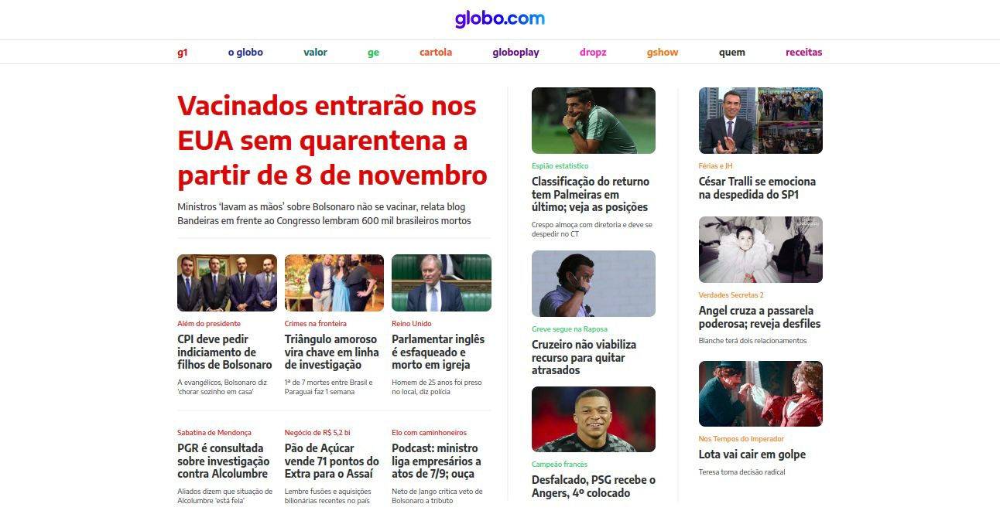

# **Globo.com**

## **Visão Geral**
Design simplificado da página inicial do site Globo.com.

## **Deploy**
***Link:*** https://projeto-globo-com-driven-cskof595v-fl3via.vercel.app/

## **Recursos Chave**
1. Aplicar o layout seguindo o Figma fornecido;
2. Utilizar a fonte Encode Sans na página;
3. Todas as notícias são links;
4. Criar imagens com bordas arredondadas;
5. Uso do cursor pointer.

## **Tecnologias Utilizadas**
- HTML;
- CSS.

### **Como Executar o Projeto Localmente**

### No Terminal 
1. **Clone o Repositório:** `git clone` https://github.com/fl3via/projeto-globo.com-driven
2. **Entre na pasta:** `cd` projeto-globo.com-driven
3. **Abra no Visual Estudio Code:** `code .`

### No Visual Estudio Code
4. Clique com o botão direito do mouse em `index.html`
5. Clique em `Open with Live Server [Alt+LAlt+O]`

